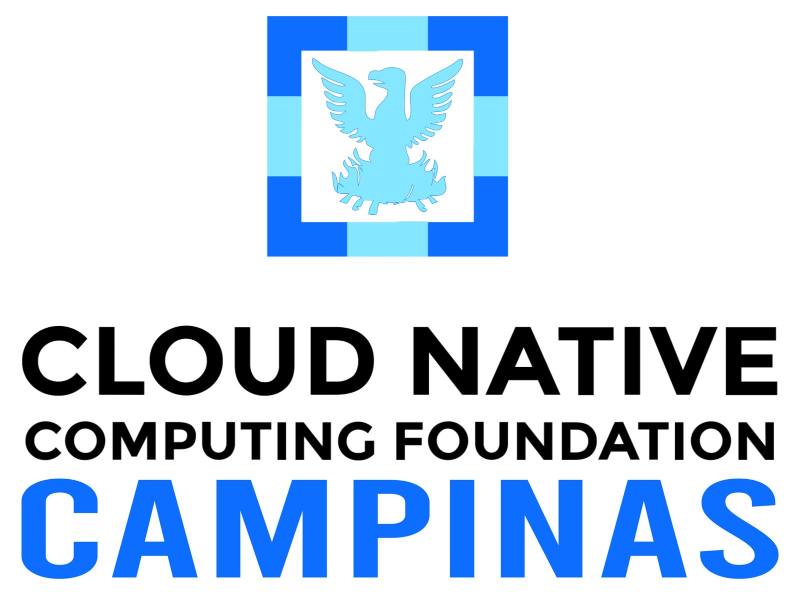
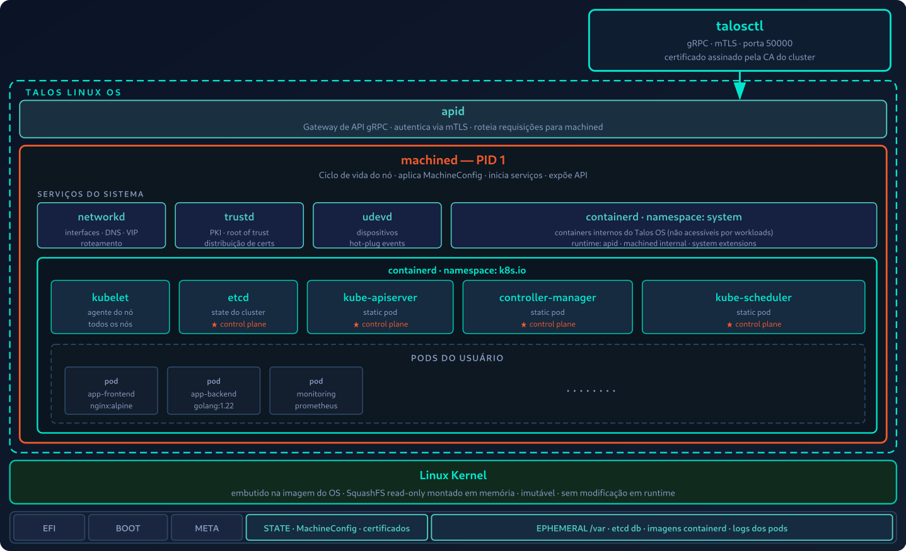

<!-- _paginate: false -->
<style scoped>
section {
  display: flex;
  flex-direction: column;
  justify-content: center;
  align-items: center;
  height: 100%;
  text-align: center;
  padding: 80px;
  position: relative;
}
h1 {
  font-size: 2.2rem;
  font-weight: 800;
  background: linear-gradient(135deg, #00E6CC 0%, #00E6CC 100%);
  -webkit-background-clip: text;
  -webkit-text-fill-color: transparent;
  background-clip: text;
  margin-bottom: 0.8rem;
  line-height: 1.1;
  letter-spacing: -0.02em;
  text-shadow: none;
}
h2 {
  font-size: 1.8rem;
  color: #F8FAFC;
  font-weight: 400;
  margin-bottom: 3rem;
  opacity: 0.9;
  position: relative;
}
h2::before {
  content: "";
  position: absolute;
  left: 50%;
  transform: translateX(-50%);
  top: -15px;
  width: 500px;
  height: 3px;
  background: linear-gradient(90deg, #00E6CC 0%, #f15a29 100%);
  border-radius: 2px;
}
h3 {
  font-size: 1.3rem;
  color: #4ECDC4;
  font-weight: 500;
  margin: 0.20rem 0;
  letter-spacing: 0.5px;
}
h3:last-of-type {
  color: #f15a29;
  font-weight: 4300;
  margin-top: 1rem;
  font-size: 1.2rem;
}
</style>

# Talos Linux + Proxmox + Terraform: infraestrutura declarativa on-premises
### Emerson Silva
### CNCF Campinas · 2026

<div style="display:flex; justify-content:center; align-items:center; gap:40px; margin-top:1.5rem;">
  
</div>

---
<!-- _paginate: false -->
<style scoped>
section {
  display: flex;
  justify-content: center;
  align-items: center;
  height: 100%;
}
h2 {
  font-size: 38pt;
  text-align: center;
  text-shadow: 1px 1px 5px #000;
  font-weight: normal;
  color: #f6f6f6;
}
</style>

## *"Não existe trabalho ruim, o ruim é ter que trabalhar."*

Seu Madruga

---
<!-- _paginate: false -->


# 🇧🇷 Emerson Silva

* Engenheiro DevOps/SRE na **4Linux**
* +9 anos em ambientes DevOps críticos
* Foco em **Kubernetes**, IaC e confiabilidade
* Escritor, instrutor e palestrante ativo na comunidade

---
<!-- _paginate: false -->

## O que veremos hoje

1. O problema: OS tradicional como ponto de fricção
2. O que é o Talos Linux
3. Arquitetura e filosofia
4. Segurança e atualizações
5. Armazenamento no Talos
6. Demo: cluster HA com Terraform + Proxmox
7. Quando faz sentido usar

---

## O problema com o OS tradicional


* Gerenciamento manual de pacotes e atualizações
* SSH aberto = superfície de ataque enorme
* Scripts de cloud-init frágeis
* Configuração manual de hardening
* **"Servidor que ninguém sabe como foi configurado"**

---

## O que é o Talos Linux?

* OS **atômico e modular** construído exclusivamente para Kubernetes
* Sem SSH · Sem shell · Sem pacotes desnecessários
* Gerenciado por **API gRPC declarativa** via `talosctl`
* Sistema de arquivos **imutável** (SquashFS read-only em memória)
* Imagem com menos de **80MB**
* `machined` como **PID 1** — escrito em Go do zero

---

## A filosofia do Talos


* **Distribuído** — HA por design, sem SPOF
* **Imutável** — sempre roda de SquashFS, zero configuration drift
* **Minimal** — sem shell, sem GNU utils, sem busybox
* **Efêmero** — tudo é reconstruível
* **Seguro** — sem senhas, mTLS, certificados auto-rotativos
* **Declarativo** — um único YAML para tudo
* **Cattle, not pets** — nós substituídos, nunca reparados

---
<!-- _footer: "" -->
<style scoped>
section {
  padding: 30px 50px;
}
h2 {
  font-size: 1.6em;
  margin-bottom: 0.4em;
}
</style>

## Arquitetura do Talos Linux



---

## Sem SSH. Sem shell. Sério.

```bash
# Tentativa de acesso via SSH
ssh root@192.168.121.72
# ssh: connect to host 192.168.121.72 port 22: Connection refused

# A forma correta: API via talosctl
talosctl -n 192.168.121.72 get members
talosctl -n 192.168.121.72 dashboard
talosctl -n 192.168.121.72 logs machined
```

> Toda interação acontece via API gRPC autenticada por certificado

---

## Arquitetura do sistema de arquivos

| Partição | Ponto de montagem | Conteúdo |
|----------|-------------------|----------|
| **EFI** | — | Dados de boot EFI |
| **BOOT** | — | Bootloader, initramfs, kernel |
| **STATE** | `/system/state` | MachineConfig, certificados |
| **EPHEMERAL** | `/var` | Dados do K8s, containerd, etcd, logs |

* Raiz: **SquashFS read-only** montado em memória
* Sem instalação de pacotes em runtime
* Reset = disco limpo e cluster de volta em minutos
* `/var` sobrevive a reboots, mas é apagado em `reset` sem `--preserve`

---

## Init system: machined vs systemd

| | Linux Tradicional | Talos Linux |
|--|--|--|
| **PID 1** | `systemd` | `machined` |
| **Função** | Gerencia serviços | Ciclo de vida completo do nó |
| **Serviços** | Units .service | `containerd` + `kubelet` via API |
| **Configuração** | `/etc/systemd/` | MachineConfig YAML |
| **Acesso** | `systemctl` + SSH | `talosctl` via gRPC |

> `machined` monta o FS, aplica a config, inicia os serviços e expõe a API — tudo sem shell

---

## Configuração declarativa
<!-- _footer: "" -->
```yaml
# Um único YAML define tudo
machine:
  network:
    interfaces:
      - deviceSelector:
          physical: true
        dhcp: true
        vip:
          ip: 192.168.121.100
cluster:
  network:
    cni:
      name: flannel
```

> Sem scripts procedurais. Sem configuração manual.
> Estado do cluster = arquivo em Git.

---

## Segurança por design: mTLS

```
talosctl → [certificado cliente] → API Talos
              ↕ mTLS bidirecional
           [CA do cluster] ← autentica ambos os lados
```

* Toda chamada à API exige **certificado assinado pela CA do cluster**
* Permissões **granulares por certificado** (ex: read-only para monitoramento)
* Sem SSH = sem `CVE-2024-6387` (regreSSHion) e similares
* Sem `apt`/`yum` = sem instalação de malware ou backdoors em runtime
* **Superfície de ataque mínima**: shell, gerenciadores de pacotes e SSH removidos por design

---

## Atualizações atômicas com boot A/B

```bash
# Atualiza o nó para uma nova versão do Talos
talosctl upgrade --nodes 192.168.121.72 \
  --image ghcr.io/siderolabs/installer:v1.9.0
```

* **Kernel embutido na imagem** — userspace e kernel sempre compatíveis
* Sistema de boot **A/B**: slot ativo e slot de standby
* Falha no upgrade → **rollback automático** para a versão anterior
* Atualizar o kernel = substituir a imagem completa do sistema
* Zero drift: o SO é sempre idêntico ao que foi testado

---

## Armazenamento: opções CSI recomendadas

| Solução | Caso de uso | Destaque |
|---------|-------------|----------|
| **Longhorn** | Simplicidade / KubeVirt | Redundância + LiveMigration |
| **Rook + Ceph** | Escala / larga escala | Escala "infinita", mais complexo |
| **OpenEBS Mayastor** | Alta performance | NVMe-TCP, baixa latência |
| **AWS EBS / GCP PD** | Nuvem | CSI nativo do provedor |
| **NFS / iSCSI** | Bare metal / on-prem | `nfs-subdir-external-provisioner` |

---

## Dimensionamento de armazenamento

* **Control plane**: mínimo **40GB** por nó (etcd reside na partição `EPHEMERAL`)
* Clusters com **100+ nós**: mesma base, mas monitoramento contínuo é essencial
* `talosctl reset` apaga `/var` — use `--preserve` para manter dados do etcd
* Evite rodar workloads pesadas nos **mesmos nós** que processam armazenamento

```bash
# Diagnóstico de armazenamento sem SSH
talosctl -n 192.168.121.72 read /proc/mounts
talosctl -n 192.168.121.72 dmesg | grep -i disk
```

---
<!-- _paginate: false -->
<style scoped>
section {
  display: flex;
  justify-content: center;
  align-items: center;
  height: 100%;
  text-align: center;
}
h2 {
  font-size: 3rem;
  color: #00E6CC;
  text-shadow: 0 0 20px rgba(0, 230, 204, 0.5);
}
</style>

## 🖥️ Demo ao vivo

---
<!-- _footer: "" -->
<style scoped>
section { padding: 30px 50px; }
h2 { font-size: 1.6em; margin-bottom: 0.4em; }
pre { font-size: 0.78em; }
</style>

## A infraestrutura da demo

```
┌─────────────────────────────────────────────┐
│              Proxmox VE (silvalabs)          │
│                                             │
│  ┌──────────┐  ┌──────────┐  ┌──────────┐  │
│  │  CP-1    │  │  CP-2    │  │  CP-3    │  │
│  │ .201/24  │  │ .202/24  │  │ .203/24  │  │
│  └──────────┘  └──────────┘  └──────────┘  │
│                                             │
│  ┌──────────┐  ┌──────────┐  ┌──────────┐  │
│  │ Worker-1 │  │ Worker-2 │  │ Worker-3 │  │
│  │ .211/24  │  │ .212/24  │  │ .213/24  │  │
│  └──────────┘  └──────────┘  └──────────┘  │
└─────────────────────────────────────────────┘
```

3 control planes HA · 3 workers · IPs estáticos · Kubernetes v1.32 · Talos v1.12.6

---

## A stack de automação

**`bpg/proxmox`** — cria VMs, faz upload de snippets, gerencia discos

**`siderolabs/talos`** — gera secrets, machineconfigs, faz bootstrap do etcd, recupera o kubeconfig

```hcl
terraform {
  required_providers {
    proxmox = { source = "bpg/proxmox",       version = "= 0.96.0" }
    talos   = { source = "siderolabs/talos",   version = "= 0.7.1"  }
  }
}
```

```
talos-cluster-proxmox/
├── modules/
│   ├── vm-talos/       ← cria cada VM no Proxmox
│   └── talos-cluster/  ← gera configs e segredos do Talos
└── prod/               ← ambiente de produção
```

---

## O que vimos na demo

```bash
# 1. Estado inicial — cluster destruído
kubectl get nodes  # connection refused

# 2. Subir tudo com um comando
terraform apply

# 3. Exportar as configs geradas pelo Terraform
terraform output -raw talosconfig > ~/.talos/config
terraform output -raw kubeconfig  > ~/.kube/config

# 4. Verificar o cluster
kubectl get nodes
talosctl health --nodes 192.168.1.201

# 5. Instalar o CNI e validar
kubectl apply -f https://github.com/flannel-io/flannel/releases/latest/download/kube-flannel.yml
kubectl get nodes  # Ready

# 6. Deploy de exemplo
kubectl create deployment nginx --image=nginx --replicas=3
kubectl get pods -o wide
```

---

## Quando usar o Talos Linux?

* ✅ Clusters Kubernetes em produção
* ✅ Ambientes que exigem hardening e compliance
* ✅ Infraestrutura GitOps e declarativa
* ✅ Bare metal, VMs, cloud e homelab
* ✅ Times que querem reduzir overhead operacional
* ✅ Armazenamento com Longhorn, Rook/Ceph ou OpenEBS via CSI

* ⚠️ Não é para workloads que precisam de SSH direto ao node
* ⚠️ Curva de aprendizado inicial existe (mas vale a pena)

---

<!-- _footer: "" -->
<style scoped>
table { font-size: 0.72em; width: 100%; }
th { background: rgba(0,230,204,0.12); color: #00E6CC; padding: 6px 14px; }
td { padding: 5px 14px; border-bottom: 1px solid rgba(255,255,255,0.06); }
tr:last-child td { border-bottom: none; }
</style>

## Comparando com o tradicional

| | Ubuntu / CentOS | Talos Linux |
|--|--|--|
| Acesso | SSH + shell bash | API gRPC · `talosctl` |
| PID 1 | `systemd` | `machined` |
| Tamanho | ~1 GB+ | ~80 MB |
| Gestão | Manual / Ansible | Declarativa via YAML |
| Sistema de arquivos | Mutável | SquashFS read-only |
| Atualizações | `apt upgrade` incremental | Atômica A/B + rollback |
| mTLS | ❌ | ✅ nativo |
| Config drift | Frequente | Impossível |
| Superfície de ataque | Alta | Mínima |

---
<!-- _paginate: false -->
<style scoped>
section {
  padding: 60px;
  display: flex;
  flex-direction: column;
}

h2 {
  font-size: 2.2em;
  color: #00C4A7;
  font-weight: 600;
  margin-bottom: 2rem;
  position: relative;
}

h2::before {
  content: "";
  position: absolute;
  left: -25px;
  top: 50%;
  transform: translateY(-50%);
  width: 4px;
  height: 50px;
  background: linear-gradient(135deg, #00E6CC, #4ECDC4);
  border-radius: 2px;
}

ul {
  list-style: none;
  margin: 0;
  padding: 0;
  display: grid;
  grid-template-columns: repeat(3, 1fr);
  gap: 1.5rem;
  margin-bottom: 0.1rem;
}

li {
  background: rgba(26, 26, 26, 0.6);
  border: 1px solid rgba(0, 230, 204, 0.2);
  border-radius: 12px;
  padding: 1.5rem;
  text-align: center;
  position: relative;
  margin-bottom: 0;
}

li::before {
  content: "";
  position: absolute;
  top: 0;
  left: 0;
  right: 0;
  height: 3px;
  background: linear-gradient(90deg, #00E6CC 0%, #f15a29 100%);
  border-radius: 12px 12px 0 0;
}

li:nth-child(1)::after { content: "01"; }
li:nth-child(2)::after { content: "02"; }
li:nth-child(3)::after { content: "03"; }

li::after {
  position: absolute;
  top: 1rem;
  left: 50%;
  transform: translateX(-50%);
  font-size: 1.6rem;
  color: #f15a29;
  font-weight: 800;
}

li { padding-top: 4rem; }

strong { color: #00E6CC; font-weight: 700; }

.final-message {
  background: linear-gradient(135deg, rgba(0, 230, 204, 0.1), rgba(241, 90, 41, 0.1));
  border: 2px solid rgba(0, 230, 204, 0.3);
  border-radius: 12px;
  padding: 0.5rem 2rem;
  text-align: center;
  margin-top: 2rem;
}

.final-message p {
  font-size: 1.0rem;
  color: #F8FAFC;
  font-weight: 500;
  margin: 0;
}

.final-message strong { color: #00E6CC; font-weight: 700; }
</style>

## Conclusão

* **Experimente** comece com `terraform apply` — do zero ao `kubectl get nodes Ready`
* **Leia a série** emerson-silva.blog.br
* Seja o próximo a **eliminar SSH** da sua infra

<div class="final-message">
  <p>Infraestrutura <strong>declarativa on-premises</strong> começa com o primeiro <strong>terraform apply</strong></p>
</div>

---
<!-- _paginate: false -->

## Obrigado!


### Recursos

* 📖 docs.siderolabs.com
* 📝 emerson-silva.blog.br
* 💬 @silvemerson

Vamos manter contato!
